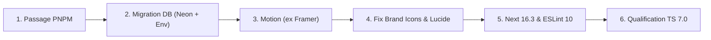

# Audit Complet des Dépendances & Feuille de Route de Migration (`my-portfolio-vk-it`)

> **Date de l'audit** : 6 Août 2026 (Révisé suite aux retours de qualification)  
> **Contexte** : Repository `my-portfolio-vk-it` (Next.js 16 App Router, TypeScript 5, React 19, Tailwind CSS 4, Drizzle ORM, Vercel Blob, Upstash Redis).  
> **Objectif** : Établir un état des lieux exact des versions, corriger les faux positifs/déprécations, intégrer les angles morts (icônes de marque Lucide, API TS 7 vs ESLint 10) et planifier l'upgrade vers **Next.js 16.3**, **TypeScript 7.0** et **PNPM**.

---

## 1. Tableau Comparatif des Dépendances (Corrigé & Révisé)

### 1.1 Dépendances de Production (`dependencies`)

| Paquet | Version package.json | Version installée | Dernière version (NPM) | Statut / Évolution Réelle | Niveau de Risque |
| :--- | :--- | :--- | :--- | :--- | :--- |
| `@radix-ui/react-slot` | `^1.2.4` | `1.3.0` | **1.3.3** | Patch update | 🟢 **Faible** |
| `@upstash/ratelimit` | `^2.0.8` | `2.0.8` | **2.0.8** | À jour | 🟢 **Faible** |
| `@upstash/redis` | `^1.36.3` | `1.38.0` | **1.38.2** | Patch update | 🟢 **Faible** |
| `@vercel/blob` | `^2.3.1` | `2.6.1` | **2.7.0** | Minor update | 🟢 **Faible** |
| `@vercel/postgres` | `^0.10.0` | `0.10.0` | **0.10.0** | ⚠️ **DÉPRÉCIÉ** (Préférer Neon Serverless) | 🔴 **Élevé** (Migration requise) |
| `class-variance-authority` | `^0.7.1` | `0.7.1` | **0.7.1** | À jour | 🟢 **Faible** |
| `clsx` | `^2.1.1` | `2.1.1` | **2.1.1** | À jour | 🟢 **Faible** |
| `drizzle-orm` | `^0.45.2` | `0.45.2` | **0.45.2** | À jour | 🟢 **Faible** |
| `framer-motion` | `^12.23.26` | `11.13.1` (Legacy) | **motion** (Projet renommé) | ⚠️ **RENOMMÉ** en `motion` (`motion/react`) | 🔴 **Élevé** (Changement de package) |
| `lucide-react` | `^0.562.0` | `0.562.0` | **1.28.0** | ⚠️ **Breaking v1.0** (Brand Icons supprimées) | 🔴 **Élevé** (Impact `Github`/`Linkedin`) |
| `next` | `^16.1.6` | `16.2.10` | **16.3.0** | Minor update (Conforme Async/Proxy) | 🟢 **Faible** |
| `next-themes` | `^0.4.6` | `0.4.6` | **0.4.6** | À jour | 🟢 **Faible** |
| `radix-ui` | `^1.4.3` | `1.6.3` | **1.6.7** | Patch update | 🟢 **Faible** |
| `react` | `^19.2.4` | `19.2.7` | **19.2.8** | Patch update | 🟢 **Faible** |
| `react-dom` | `^19.2.4` | `19.2.7` | **19.2.8** | Patch update | 🟢 **Faible** |
| `server-only` | `^0.0.1` | `0.0.1` | **0.0.1** | À jour | 🟢 **Faible** |
| `sonner` | `^2.0.7` | `2.0.7` | **2.0.7** | À jour | 🟢 **Faible** |
| `tailwind-merge` | `^3.4.0` | `3.4.0` | **3.6.0** | Minor update | 🟢 **Faible** |
| `zod` | `^4.3.6` | `4.3.6` | **4.4.3** | Minor update | 🟢 **Faible** |

---

### 1.2 Dépendances de Développement (`devDependencies`)

| Paquet | Version package.json | Version installée | Dernière version (NPM) | Statut / Évolution Réelle | Niveau de Risque |
| :--- | :--- | :--- | :--- | :--- | :--- |
| `@eslint/eslintrc` | `^3` | `3.3.0` | **3.3.6** | Patch update | 🟢 **Faible** |
| `@next/env` | `^16.2.4` | `16.2.10` | **16.3.0** | Minor update | 🟢 **Faible** |
| `@tailwindcss/postcss` | `^4` | `4.0.0` | **4.3.3** | Minor update | 🟢 **Faible** |
| `@types/node` | `^20` | `20.19.43` | **20.x / 22.x** (LTS) | Aligner sur Vercel Node LTS (pas Node 26) | 🟢 **Faible** |
| `@types/pg` | `^8.20.0` | `8.20.0` | **8.20.4** | Patch update | 🟢 **Faible** |
| `@types/react` | `^19` | `19.2.17` | **19.2.18** | Patch update | 🟢 **Faible** |
| `@types/react-dom` | `^19` | `19.2.3` | **19.2.4** | Patch update | 🟢 **Faible** |
| `drizzle-kit` | `^0.31.10` | `0.31.10` | **0.31.10** | À jour | 🟢 **Faible** |
| `eslint` | `^9` | `9.39.5` | **10.8.0** | 🚨 **Urgent** (ESLint 9 EOL aujourd'hui 06/08/26) | 🟡 **Moyen** |
| `eslint-config-next` | `16.1.6` | `16.1.6` | **16.3.0** | Minor update | 🟢 **Faible** |
| `tailwindcss` | `^4` | `4.0.0` | **4.3.3** | Minor update | 🟢 **Faible** |
| `tw-animate-css` | `^1.4.0` | `1.4.0` | **1.4.0** | À jour | 🟢 **Faible** |
| `typescript` | `^5` | `5.9.3` | **7.0.2** | 🚀 **TS 7.0** (API non programmatique avant 7.1) | 🟡 **Moyen** (À séparer d'ESLint 10) |

---

## 2. Analyse Approfondie des Angles Morts & Déprécations

### 🔴 1. Renommage Majeur : `framer-motion` ➔ `motion`
* **Factuel** : Le projet `framer-motion` a été officiellement renommé en **`motion`**. Le package `framer-motion` (gelé à 11.13.1) affiche un bandeau officiel recommandant l'import depuis `motion/react`.
* **Impact Code Portfolio** : 6 fichiers utilisent actuellement `framer-motion` (`src/app/brief/page.tsx`, `src/app/error.tsx`, `src/app/not-found.tsx`, `src/app/page.tsx`, `src/app/projets/page.tsx`, `src/app/ressources/page.tsx`).
* **Migration** :
  1. `pnpm remove framer-motion && pnpm add motion`
  2. Remplacer `import { motion } from "framer-motion"` par `import { motion } from "motion/react"`.

---

### 🔴 2. Piège `lucide-react` v1.0 : Suppression des Brand Icons
* **Factuel** : `lucide-react` v1.0 a supprimé toutes les icônes de marques déposées (`Github`, `Linkedin`, `Twitter`, etc.) pour éviter tout litige légal.
* **Impact Code Portfolio** : [`src/app/page.tsx`](file:///Users/karacaveli/Documents/Dev/my-portfolio-vk-it/src/app/page.tsx#L6) importe directement `Github` et `Linkedin` depuis `lucide-react`. Une mise à jour vers v1.0 casserait immédiatement le build ou ferait disparaître ces icônes.
* **Migration** :
  - Conserver ou remplacer `Github` et `Linkedin` par des composants SVG custom ou la bibliothèque dédiée `simple-icons` avant la montée de version de `lucide-react`.

---

### 🟡 3. Compatibilité TypeScript 7.0 vs ESLint 10 (`typescript-eslint`)
* **Factuel** :
  - **ESLint 9** atteint sa fin de vie officielle (EOL) ce **6 août 2026**. Le passage à **ESLint 10** est donc hautement prioritaire.
  - **TypeScript 7.0** utilise le nouveau compilateur natif ultra-rapide (Go), mais son API programmatique pour les linters ne sera stabilisée qu'en **TS 7.1** (~octobre 2026).
  - `eslint-config-next` s'appuie sur `typescript-eslint` qui dépend de l'API programmatique TS.
* **Risque** : Regrouper l'upgrade TypeScript 7 et ESLint 10 dans la même étape risque d'invalider le linter silencieusement ou de lever des erreurs d'incompatibilité AST.
* **Stratégie** : **Découpler impérativement** la montée ESLint 10 de la montée TypeScript 7, et valider `pnpm lint` isolément après chacune d'elles.

---

### 🟢 4. Nuance sur `@types/node`
* **Factuel** : `@types/node@26.1.2` correspond à Node.js 26 (Current), non encore qualifié en LTS (LTS prévu en octobre 2026).
* **Recommandation** : Fixer `@types/node` sur la version LTS configurée dans le runtime Vercel (ex: **`^20.0.0`** ou **`^22.0.0`**) pour éviter de valider des types pour des APIs absentes de l'environnement Vercel de production.

---

### ⚠️ 5. Dépréciation DB `@vercel/postgres` & Standardisation Propre de la Variable DB
* **Factuel** : `@vercel/postgres` est déprécié au profit de Neon Serverless (`@neondatabase/serverless`).
* **Nettoyage des Variables Vercel** : Les variables historiques (`POSTGRES_URL`, `POSTGRES_DATABASE_URL`, etc.) sont issues de la migration automatique en coulisses de Vercel. 
* **Bonne Pratique de Code (Pas de fallback silencieux)** : Au lieu d'un fallback masquant les erreurs, nous imposerons une vérification explicite qui lève une erreur claire dès le démarrage du serveur si la variable est absente :
  ```typescript
  import { drizzle } from "drizzle-orm/neon-http";
  import { neon } from "@neondatabase/serverless";
  import * as schema from "./schema";

  const connectionString = process.env.DATABASE_URL || process.env.POSTGRES_URL;

  if (!connectionString) {
    throw new Error(
      "Erreur DB : Aucune variable d'environnement de connexion trouvée (DATABASE_URL ou POSTGRES_URL)."
    );
  }

  const sql = neon(connectionString);
  export const db = drizzle({ client: sql, schema });
  ```

---

## 3. Feuille de Route de Migration Révisée (6 Étapes Sécurisées)



### 🔹 Étape 1 : Transition Outillage vers PNPM
- Nettoyage de `package-lock.json` et du dossier `node_modules/`.
- Installation et génération du fichier `pnpm-lock.yaml` via `pnpm install`.
- Validation du build initial : `pnpm build`.

### 🔹 Étape 2 : Traitement de la Dépréciation Database & Standardisation Env
- **Action Dashboard Vercel (Pour ne pas oublier)** :
  1. Aller dans *Vercel > Project Settings > Environment Variables*.
  2. Ajouter/standardiser la variable `DATABASE_URL` avec la valeur de connexion Neon (ou copier `POSTGRES_URL`).
  3. Mettre à jour `.env.local` en local avec `DATABASE_URL`.
- **Action Code** :
  1. `pnpm add @neondatabase/serverless && pnpm remove @vercel/postgres`.
  2. Modifier [`src/lib/db.ts`](file:///Users/karacaveli/Documents/Dev/my-portfolio-vk-it/src/lib/db.ts) avec `drizzle-orm/neon-http` et le contrôle strict `if (!connectionString) throw new Error(...)`.
- Validation : `pnpm build`.

### 🔹 Étape 3 : Migration `framer-motion` ➔ `motion`
- `pnpm remove framer-motion && pnpm add motion`.
- Remplacement des imports `"framer-motion"` par `"motion/react"` dans les 6 fichiers de l'application.
- Validation : `pnpm build`.

### 🔹 Étape 4 : Protection des Brand Icons & Upgrade `lucide-react`
- Remplacement des icônes `Github` et `Linkedin` dans `src/app/page.tsx` par des SVG/composants dédiés.
- Upgrade de `lucide-react` vers `1.28.0` et des composants UI.
- Validation visuelle et build : `pnpm dev` / `pnpm build`.

### 🔹 Étape 5 : Upgrade Next.js 16.3 & Passage ESLint 10 (Fin de vie ESLint 9)
- Upgrade `next@16.3.0`, `@next/env@16.3.0`, `eslint-config-next@16.3.0` et `eslint@10.8.0`.
- Validation spécifique du linter : `pnpm lint`.
- Validation du build : `pnpm build`.

### 🔹 Étape 6 : Qualification TypeScript 7.0 (Étape Isolée)
- Upgrade de `typescript` vers `7.0.2` et ajustement de `@types/node` sur la version LTS Vercel (`^20` ou `^22`).
- Test ciblé de l'intégration avec `typescript-eslint` via `pnpm lint`.
- Validation finale complète de l'application : `pnpm build`.

---

> **Note** : Aucune ligne de code n'a été modifiée. Le document révisé est synchronisé dans le repo sous [`audit-dependances.md`](file:///Users/karacaveli/Documents/Dev/my-portfolio-vk-it/audit-dependances.md).
